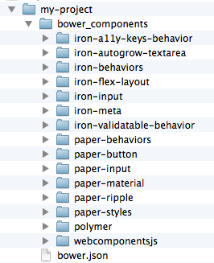

## Introduction

The Polymer element sets provide elements that you can use in your web pages 
and apps. These elements are built with the [Polymer library](https://www.polymer-project.org).

**You don't need to use Polymer directly** to use these elements.
However, using Polymer you can take advantage of special
features such as data binding.

## Installing Elements

You can install elements one at a time, or install a whole collection of elements.

Polymer contains a few primary collections of elements:

-   [Iron elements](/browse?package=iron-elements). A set of utility
    elements including generic UI elements (such as icons, input and layout
    components), as well as non-UI elements providing features like AJAX, signaling and storage.

-   [Paper elements](/browse?package=paper-elements). A set of UI elements that implement the
    [material design system](http://www.google.com/design/spec/material-design/).

-   [Gold elements](/browse?package=gold-elements). Form elements for ecommerce.

-   [Neon elements](/browse?package=neon-elements). Animation-related elements.

-   [Platinum elements](/browse?package=platinum-elements). Elements for app-like features, 
    like push notifications and offline caching.


If you find a component you want while browsing the docs, simply click **Add to cart** 
<iron-icon class="inline-icon" icon="add-shopping-cart"></iron-icon>.
Don't worry — they're all free!

From the cart, you can download either a `bower.json` file or a ZIP file.

*   `bower.json` file. Just the metadata you need to install the components using
    Bower.
    
    Bower is the recommended way to manage components. Bower also handles installing
    the components' dependencies and updating installed components. For more information, 
    see [Installing with Bower](#installing-with-bower).

*   ZIP file. A single file containing your selected components and all their dependencies, 
    so you can unzip and start using them immediately. The ZIP file requires no extra tools, 
    but doesn't provide a built-in method for updating dependencies. For more information, see
    [Installing from ZIP files](#installing-from-zip-files).

To download the components in your cart:

1.  Click the **Cart** <iron-icon class="inline-icon" icon="shopping-cart"></iron-icon> 
    and select the **Download** tab.

2.  Choose a download format and click **Download**.

Pick your method and follow the instructions in the download dialog.

If you install one or more elements, you also get the
[Polymer library](https://www.polymer-project.org), as well as the [web components polyfills](http://webcomponents.org/polyfills/),
which allow you to run Polymer on browsers that don't yet support
the web components standards.

### Installing with Bower

The recommended way to install **Polymer** elements
is through Bower. To install Bower, see the [Bower web site](http://bower.io/).

Bower removes the hassle of dependency management when developing or consuming
elements. When you install a component, Bower makes sure any dependencies are
installed as well.

#### Project setup

If you haven't created a `bower.json` file for your application, run this
command from the root of your project:

    bower init

This generates a basic `bower.json` file. Some of the questions, like
"What kind of modules do you expose," can be ignored by pressing Enter.

From the **cart**, select the `bower.json` download and paste the 
`dependencies` section into your generated `bower.json` file. The resulting
file should look something like this:

```
{
  "name": "my-project",
  "version": "0.0.0",
  "dependencies": {
    "iron-a11y-keys": "PolymerElements/iron-a11y-keys#^1.0.0",
    "iron-ajax": "PolymerElements/iron-ajax#^1.0.0",
    "paper-button": "PolymerElements/paper-button#^1.0.0"
  }
}
```

The next step is to install your selected components:

    bower install

Bower adds a `bower_components/` folder in the root of your project and
fills it with your selected elements and their dependencies.


#### Installing from the command line

You can also install components from the command line using the `bower install` command.

You can also choose one of the commonly-used packages:

-   `PolymerElements/iron-elements`

-   `PolymerElements/paper-elements`

-   `PolymerElements/gold-elements`

For example:

    bower install --save PolymerElements/iron-elements

<aside>
<b>Tip:</b> <code>--save</code> adds the item as a dependency in your app's <code>bower.json</code>.
</aside>


#### Updating packages

When a new version of Polymer is available, run `bower update`
in your app directory to update your copy:

    bower update

This updates all packages in `bower_components/`.

### Installing from a ZIP file

When you download a component or component set as a ZIP file, you get all of
the dependencies bundled into a single archive. It's a great way to get
started because you don't need to install any additional tools.

Expand the ZIP file in your project directory to create a `bower_components` folder.



Unlike Bower, the ZIP file doesn't provide a built-in method
for updating dependencies. You can manually update components with a new ZIP
file, or you can update the files using Bower.

#### Migrating from a ZIP file to Bower

If you downloaded a ZIP file and subsequently install Bower, you can
use `bower init` to create a new `bower.json` file with your existing
dependencies in it:

    bower init

This generates a basic `bower.json` file. 

Enter **Y** when prompted to set currently installed components as dependencies.

Some of the questions, like "What kind of modules do you expose," can be skipped 
by pressing Enter.


## Using elements

To use elements, first load the web components polyfill library, `webcomponents-lite.min.js`. 
Many browsers have yet toimplement the various web components APIs. Until they do, `webcomponents-lite`
provides [polyfill support](http://webcomponents.org/polyfills/). **Be sure to include
this file before any code that touches the DOM.**

Once you have some elements installed and you've loaded `webcomponents-lite.min.js`,
using an element is simply a matter of loading the element file using an
[HTML Import](http://webcomponents.org/articles/introduction-to-html-imports/).

An example `index.html` file:

    <!DOCTYPE html>
    <html>
      <head>
        <!-- 1. Load webcomponents-lite.min.js for polyfill support. -->
        <script src="bower_components/webcomponentsjs/webcomponents-lite.min.js">
        </script>

        <!-- 2. Use an HTML Import to bring in some elements. -->
        <link rel="import" href="bower_components/paper-button/paper-button.html">
        <link rel="import" href="bower_components/paper-input/paper-input.html">
      </head>
      <body>
        <!-- 3. Declare the element. Configure using its attributes. -->
        <paper-input label="Your name here"></paper-input>
        <paper-button>Say Hello</paper-button>
        <div id="greeting"></div>

        <script>
          // To ensure that elements are ready on polyfilled browsers, 
          // wait for WebComponentsReady. 
          document.addEventListener('WebComponentsReady', function() {
            var input = document.querySelector('paper-input');
            var button = document.querySelector('paper-button');
            var greeting = document.getElementById("greeting");
            button.addEventListener('click', function() {
              greeting.textContent = 'Hello, ' + input.value;
            });
          });
        </script>
      </body>
    </html>

<aside>
<b>Note:</b> You must run your app from a web server for the [HTML Imports](http://webcomponents.org/articles/introduction-to-html-imports/)
polyfill to work properly. This requirement goes away when the API is available natively.
</aside>


If you aren't using the polyfill, you can't rely on the `WebComponentsReady` event. Instead, 
simply place script at the end of the file (after any custom elements).

###  Passing object and array values in attributes

[HTML attributes](https://developer.mozilla.org/en-US/docs/Web/HTML/Attributes) are string values, but sometimes you need to pass more complicated values into a custom element, such as objects or arrays. Ultimately, it's up to the element author to decide how to decode values passed in as attributes, but many Polymer elements understand attribute values that are a JSON-serialized object or array. For example:

    <roster-list persons='[{"name": "John"}, {"name": "Bob"}]'></roster-list>

For Polymer elements, you can find the expected type for each attribute listed in the API docs. If you pass the wrong type, it may be decoded incorrectly.

<!-- 
## Next steps

Now that you've got the basic idea of using and installing elements, it's time to start
building something!

In the next section we'll cover using the Core layout elements
to structure an application's layout.  Continue on to:

<p>
<a href="../elements/layout-elements.html">
  <paper-button raised><core-icon icon="arrow-forward" ></core-icon>Layout elements</paper-button>
</a>
</p>

To learn about building your own elements using the Polymer library, see
[Polymer in 10 minutes](creatingelements.html).

If you'd rather browse the existing elements, check out the
<a href="../elements/core-elements.html">Polymer Core elements</a>
and <a href="../elements/paper-elements.html">Paper elements</a> catalogs.
-->

